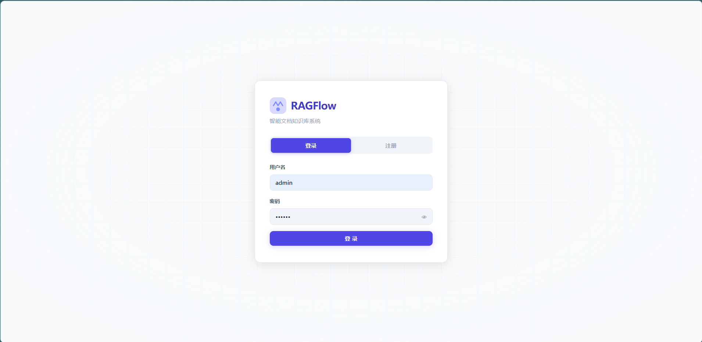
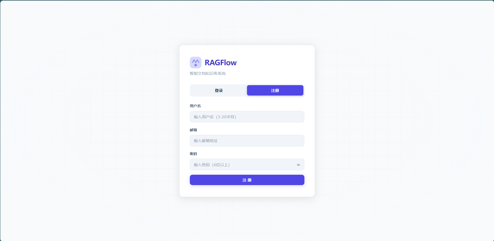
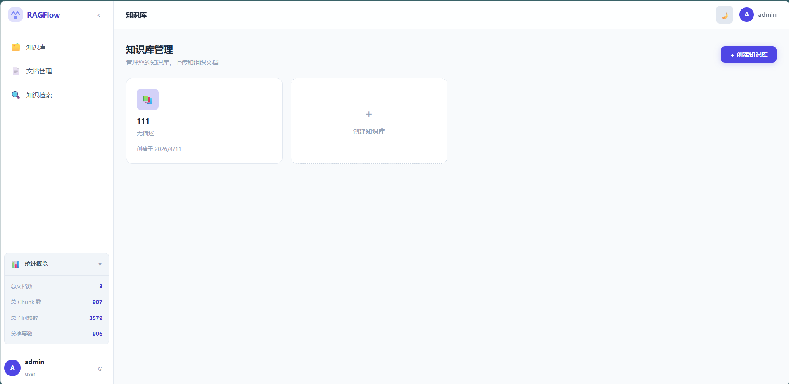
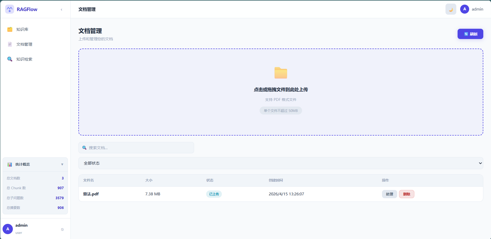
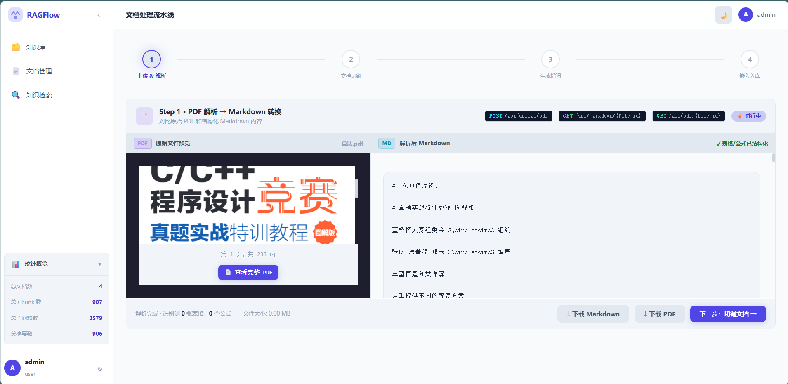
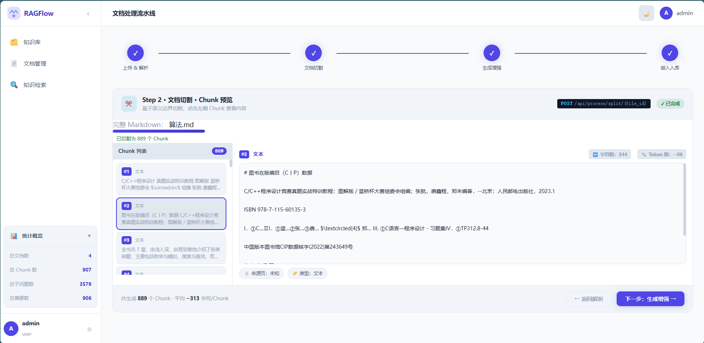
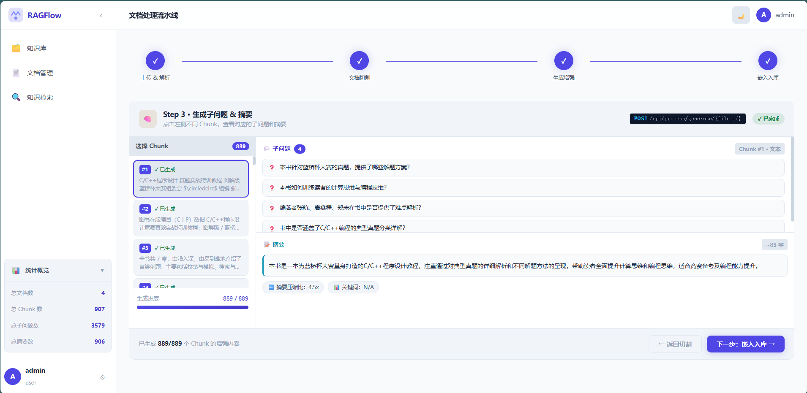
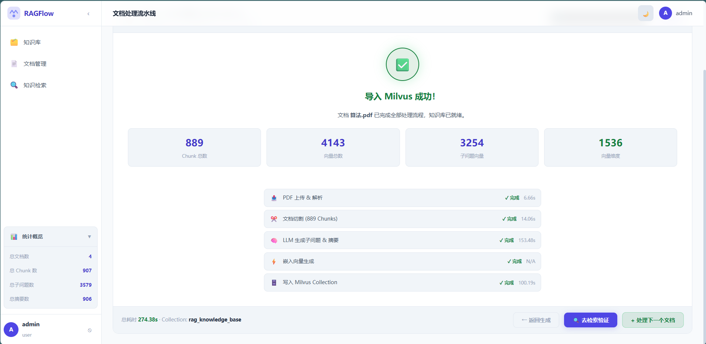
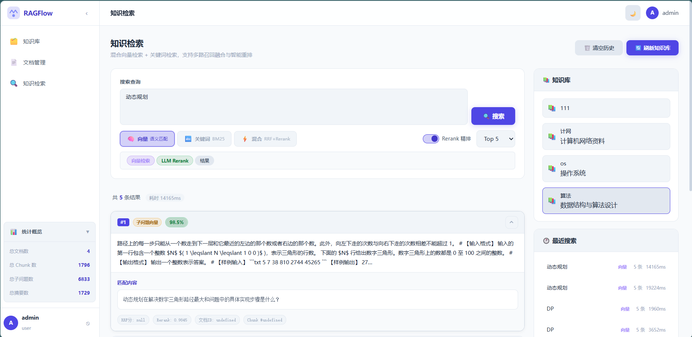
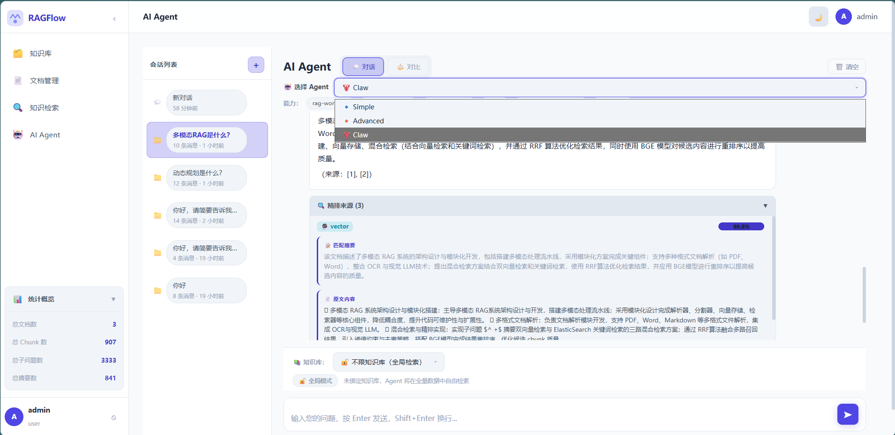

# RAGFlow - 智能知识库系统

[](https://opensource.org/licenses/MIT)

RAGFlow是一个基于Retrieval-Augmented Generation (RAG)技术的智能知识库系统，提供文档管理、知识库构建、智能检索和AI问答等功能。

## 功能展示

### 系统截图

| 登录页面 | 注册页面 |
|:---:|:---:|
|  |  |

| 知识库管理 | 文档上传 |
|:---:|:---:|
|  |  |

| 文档解析 | 文档分块 |
|:---:|:---:|
|  |  |

| 子问题与摘要生成 | 向量数据库导入 |
|:---:|:---:|
|  |  |

| 知识检索 | AI Agent |
|:---:|:---:|
|  |  |

## 项目简介

RAGFlow旨在通过先进的RAG技术，为用户提供高效、准确的知识检索和问答能力。系统支持PDF文档的解析、分割、向量化存储，并通过向量数据库和全文检索引擎实现智能搜索。

### 核心特性

- **多知识库管理**：创建和管理多个知识库，支持文档分类存储
- **完整文档处理流程**：PDF解析 → 文档分割 → 子问题生成 → 摘要生成 → 向量化存储
- **混合检索**：结合向量检索（Milvus）和全文检索（BM25/Elasticsearch），提供高精度的知识检索
- **多策略重排序**：支持Reranker对搜索结果进行精排优化
- **AI Agent问答**：基于LangGraph构建的智能问答Agent，支持多种意图识别和对话管理
- **多级记忆管理**：支持会话记忆和长期记忆的持久化存储
- **响应式设计**：支持暗黑/明亮模式切换，提供良好的用户体验

## 技术栈

### 后端技术

| 类别 | 技术 |
|------|------|
| 核心框架 | Python 3.9+ / FastAPI |
| 向量数据库 | Milvus 2.2+ |
| 全文检索 | Elasticsearch 7.17+ / BM25 |
| 关系数据库 | PostgreSQL 13+ / SQLite |
| LLM框架 | LangChain / LiteLLM |
| 工作流引擎 | LangGraph |
| 数据验证 | Pydantic v2 |

### 前端技术

| 类别 | 技术 |
|------|------|
| 页面结构 | HTML5 |
| 样式 | CSS3（支持暗黑模式） |
| 逻辑 | JavaScript (ES6+) |
| Markdown渲染 | Marked.js |
| PDF预览 | PDF.js |

## 项目结构

```
rag-for-qw/
├── backend/                     # 后端代码
│   ├── api/                    # API路由模块
│   │   ├── __init__.py         # API路由注册
│   │   ├── auth.py             # 认证相关API
│   │   ├── documents.py        # 文档管理API
│   │   ├── files.py            # 文件处理API
│   │   ├── knowledge_bases.py  # 知识库管理API
│   │   ├── processing.py       # 文档处理API
│   │   ├── search.py           # 搜索API
│   │   ├── stats.py            # 统计API
│   │   └── agent.py            # Agent API
│   ├── agent/                  # 智能代理模块
│   │   ├── base.py             # Agent基础抽象
│   │   ├── registry.py         # Agent注册中心
│   │   ├── retrieval.py        # 检索策略
│   │   ├── simple/             # 简单Agent实现
│   │   ├── advanced/            # 高级Agent（意图分类/任务规划）
│   │   └── claw_agent/          # Claw Agent（LangGraph工作流）
│   │       ├── memory/          # 记忆管理
│   │       │   ├── memory_manager.py   # 记忆管理器
│   │       │   └── session_store.py    # 会话存储
│   │       ├── tools/           # Agent工具
│   │       │   └── rag_tools.py # RAG工具集
│   │       └── rag_workflow.py  # RAG工作流定义
│   ├── services/               # 核心服务
│   │   ├── __init__.py
│   │   ├── agent.py            # Agent服务
│   │   ├── auth.py             # 认证服务
│   │   ├── database.py         # 数据库服务
│   │   ├── document_processor.py # 文档处理器
│   │   ├── elasticsearch_client.py # ES客户端
│   │   ├── milvus_client.py    # Milvus客户端
│   │   ├── pdf_parser.py       # PDF解析器
│   │   ├── reranker.py          # 重排序服务
│   │   ├── storage.py           # 存储服务
│   │   └── bm25_client.py       # BM25检索客户端
│   ├── scripts/                # 工具脚本
│   │   ├── reset_database.py    # 数据库重置脚本
│   │   ├── rebuild_documents.py # 文档重建脚本
│   │   └── verify_database_schema.py # 数据库验证脚本
│   ├── app.py                  # 应用入口
│   ├── config.py               # 配置管理
│   ├── requirements.txt        # 依赖管理
│   └── .env.example            # 环境变量示例
├── frontend/                   # 前端代码
│   ├── css/
│   │   └── main.css            # 主样式文件（含暗黑模式）
│   ├── js/
│   │   ├── api.js              # API调用封装
│   │   ├── app.js              # 应用入口
│   │   ├── auth.js             # 认证逻辑
│   │   └── pages/
│   │       ├── knowledge-bases.js # 知识库管理页面
│   │       ├── documents.js      # 文档管理页面
│   │       ├── pipeline.js       # 文档处理流程页面
│   │       ├── search.js         # 知识检索页面
│   │       └── agent.js          # AI Agent页面
│   └── index.html              # 主HTML文件
├── img/                        # 项目截图
│   ├── login.png               # 登录页面
│   ├── registration.png        # 注册页面
│   ├── knowledge_base.png      # 知识库管理
│   ├── upload.png              # 文档上传
│   ├── parse_show.png          # 文档解析
│   ├── chunks.png              # 文档分块
│   ├── subq_summary.png        # 子问题与摘要
│   ├── import_milvus.png       # 向量数据库导入
│   ├── retrive.png             # 知识检索
│   └── agent.png               # AI Agent
└── README.md                   # 项目说明
```

## 快速开始

### 前置条件

- Python 3.9+
- PostgreSQL 13+ (支持SQLite作为替代)
- Milvus 2.2+
- Elasticsearch 7.17+ (可选，支持BM25替代)
- Node.js 14+ (可选，用于前端开发)

### 安装步骤

1. **克隆项目**

```bash
git clone <repository-url>
cd rag-for-qw
```

2. **配置环境变量**

```bash
# 复制环境变量示例文件
cp backend/.env.example backend/.env

# 编辑.env文件，配置相关参数
# 主要包括数据库连接、Milvus连接、Elasticsearch连接、API密钥等
```

3. **安装后端依赖**

```bash
cd backend
pip install -r requirements.txt
```

4. **初始化数据库**

```bash
# 运行数据库初始化脚本
python scripts/reset_database.py
```

5. **启动后端服务**

```bash
python app.py
# 或使用uvicorn
uvicorn app:app --host 0.0.0.0 --port 8003
```

6. **启动前端服务**

```bash
# 在frontend目录下启动静态文件服务器
cd frontend
python -m http.server 8000
```

7. **访问系统**

打开浏览器，访问 `http://localhost:8000`

## 配置说明

### 环境变量配置

主要配置项位于 `backend/.env`：

| 配置项 | 说明 | 默认值 |
|--------|------|--------|
| `DATABASE_URL` | PostgreSQL/SQLite数据库连接 | `sqlite:///./data.db` |
| `MILVUS_HOST` | Milvus服务地址 | `localhost` |
| `MILVUS_PORT` | Milvus服务端口 | `19530` |
| `ES_HOST` | Elasticsearch地址 | `localhost` |
| `ES_PORT` | Elasticsearch端口 | `9200` |
| `OPENAI_API_KEY` | OpenAI API密钥 | - |
| `JWT_SECRET_KEY` | JWT加密密钥 | - |
| `STORAGE_TYPE` | 存储类型(local/oss) | `local` |

详细配置请参考 `backend/config.py` 文件。

## API文档

### 认证API

| 方法 | 端点 | 说明 |
|------|------|------|
| POST | `/api/auth/register` | 用户注册 |
| POST | `/api/auth/login` | 用户登录 |
| POST | `/api/auth/logout` | 用户登出 |

### 知识库API

| 方法 | 端点 | 说明 |
|------|------|------|
| GET | `/api/knowledge-bases` | 获取知识库列表 |
| POST | `/api/knowledge-bases` | 创建知识库 |
| GET | `/api/knowledge-bases/{kb_id}` | 获取知识库详情 |
| PUT | `/api/knowledge-bases/{kb_id}` | 更新知识库 |
| DELETE | `/api/knowledge-bases/{kb_id}` | 删除知识库 |

### 文档API

| 方法 | 端点 | 说明 |
|------|------|------|
| GET | `/api/documents` | 获取文档列表 |
| GET | `/api/documents/pending` | 获取待处理文档 |
| GET | `/api/documents/{doc_id}` | 获取文档详情 |
| DELETE | `/api/documents/{doc_id}` | 删除文档 |

### 文件API

| 方法 | 端点 | 说明 |
|------|------|------|
| POST | `/api/upload/pdf` | 上传PDF文件 |
| GET | `/api/markdown/{file_id}` | 获取Markdown内容 |
| GET | `/api/pdf/{file_id}` | 获取PDF内容 |

### 处理API

| 方法 | 端点 | 说明 |
|------|------|------|
| POST | `/api/process/split/{file_id}` | 分割文档 |
| POST | `/api/process/generate/{file_id}` | 生成子问题和摘要 |
| POST | `/api/process/import/{file_id}` | 导入到向量数据库 |
| POST | `/api/process/full/{file_id}` | 完整处理流程 |

### 搜索API

| 方法 | 端点 | 说明 |
|------|------|------|
| POST | `/api/milvus/query` | 向量检索（Milvus） |
| POST | `/api/elasticsearch/search` | 全文检索（ES） |
| POST | `/api/bm25/search` | BM25检索 |
| POST | `/api/hybrid/search` | 混合检索 |

### Agent API

| 方法 | 端点 | 说明 |
|------|------|------|
| POST | `/api/agent/chat` | Agent对话 |
| GET | `/api/agent/history/{session_id}` | 获取对话历史 |
| DELETE | `/api/agent/history/{session_id}` | 清除对话历史 |

### 统计API

| 方法 | 端点 | 说明 |
|------|------|------|
| GET | `/api/stats/overview` | 获取系统统计概览 |

## 前端功能

### 1. 知识库管理

- 创建和管理知识库
- 查看知识库列表和详情
- 编辑知识库名称和描述
- 删除知识库

### 2. 文档管理

- 上传PDF文档到指定知识库
- 查看文档列表和状态
- 处理文档（解析、分割、生成子问题和摘要）
- 删除文档

### 3. 文档处理流程

- **PDF解析**：将PDF文档转换为Markdown格式
- **文档分割**：将文档分割为多个语义chunk
- **子问题生成**：为每个chunk生成相关子问题
- **摘要生成**：为chunk内容生成摘要
- **向量化存储**：将chunk、子问题和摘要向量化并存储到Milvus
- **全文索引**：将内容索引到Elasticsearch/BM25

### 4. 知识检索

- 支持多种检索模式：
  - 向量检索（Milvus）
  - 全文检索（Elasticsearch/BM25）
  - 混合检索（向量+关键词融合）
- 使用RRF算法融合多种检索结果
- 支持Reranker精排优化
- 查看检索结果和相关度评分

### 5. AI Agent

- 基于LangGraph构建的智能问答Agent
- 支持多种意图识别：
  - 问候意图
  - 澄清意图
  - RAG问答意图
- 完整RAG工作流：
  - 查询扩展（生成子问题）
  - 混合检索（Milvus + ES并行）
  - 交叉编码器重排序
  - LLM生成回答
- 多级记忆管理：
  - 会话级记忆
  - 长期记忆存储

### 6. 系统设置

- 暗黑/明亮模式切换
- 用户信息管理
- 系统统计概览

## 核心架构

### Agent系统架构

系统实现了三种不同级别的Agent：

```
┌─────────────────────────────────────────────┐
│              Agent Registry                  │
├─────────────┬─────────────┬─────────────────┤
│   Simple    │  Advanced   │      Claw       │
│   Agent     │   Agent     │   (LangGraph)   │
├─────────────┼─────────────┼─────────────────┤
│ • 基础检索   │ • 意图分类   │ • 完整工作流     │
│ • 简单问答   │ • 任务规划   │ • SSE流式输出    │
│             │ • 工具管理   │ • 多级记忆      │
└─────────────┴─────────────┴─────────────────┘
```

### 文档处理流程

```
PDF上传 → PDF解析 → 文档分割 → 子问题生成 → 摘要生成 → 向量存储 → 全文索引
    │         │          │            │           │          │          │
    ▼         ▼          ▼            ▼           ▼          ▼          ▼
  文件存储   Markdown   Chunk列表    SubQ列表    Summary    Milvus     ES/BM25
                                     列表       列表
```

### 搜索流程

```
用户查询 → 查询扩展 → 并行检索 → 结果融合 → 重排序 → 返回结果
            │         │           │          │
            ▼         ▼           ▼          ▼
         子问题    Milvus+ES    RRF算法   CrossEncoder
                    并行
```

## 部署指南

### 开发环境

按照快速开始步骤部署即可。

### 生产环境

1. **使用Gunicorn + Uvicorn**

```bash
pip install gunicorn
cd backend
gunicorn -w 4 -k uvicorn.workers.UvicornWorker app:app
```

2. **使用Nginx作为反向代理**

```nginx
server {
    listen 80;
    server_name your-domain.com;

    location /api/ {
        proxy_pass http://localhost:8003;
        proxy_set_header Host $host;
        proxy_set_header X-Real-IP $remote_addr;
        proxy_set_header X-Forwarded-For $proxy_add_x_forwarded_for;
    }

    location / {
        root /path/to/frontend;
        index index.html;
        try_files $uri $uri/ /index.html;
    }
}
```

3. **配置HTTPS**

使用Let's Encrypt或其他SSL证书提供商配置HTTPS。

## 项目依赖

### Python依赖

主要依赖见 `backend/requirements.txt`，核心包括：

- fastapi>=0.104.0
- uvicorn>=0.24.0
- pydantic>=2.0.0
- langchain>=0.1.0
- langgraph>=0.0.20
- langchain-openai>=0.0.5
- pymilvus>=2.3.0
- elasticsearch>=8.0.0
- sqlalchemy>=2.0.0
- python-multipart>=0.0.6
- python-jose>=3.3.0
- passlib>=1.7.4

## 贡献指南

1. **Fork项目**
2. **创建分支**
3. **提交代码**
4. **创建Pull Request**

## 许可证

本项目采用MIT许可证。

---

*RAGFlow - 让知识检索更智能*
