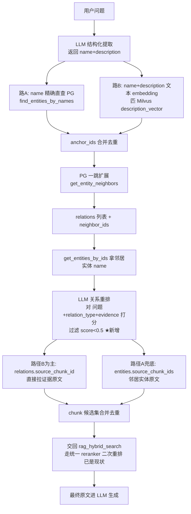

# GraphStrategy 升级方案：对齐 GraphRAG 标准流程

> 分支：`feature/c-round2`  
> 日期：2026-09-09  
> 关联：文档 06 Phase 2（GraphRAG-lite）、C 轮2 KB65 验证

## 1. 背景与动机

当前 `GraphStrategy`（`backend/services/retrieval_strategies.py` line 312-460）实现了 GraphRAG-lite 的基础流程，但与 GraphRAG 标准流程对比有 3 个真实差距：

1. **向量匹配语义空间不一致**：路 B 用 `query_embedding`（问题向量）匹 Milvus `description_vector`（实体 name+description 向量），一个是疑问句，一个是名词+陈述，语义分布有偏移，命中率低。
2. **关系数据"白查"**：`get_entity_neighbors` 返回的 `relations` 变量在 line 406 拿到后，后续打分/chunk 收集完全没用，只打了个日志——关系只被当作"找邻居的跳板"，没参与下游逻辑。
3. **缺 LLM 关系重排**：一跳扩展会拉出多条关系，未用 LLM 判断关系与问题的相关性，机械按 base score（0.9 锚点 / 0.75 非锚点）排序，可能引入噪声关系。

存储层（PG entity/entity_relation + Milvus entity_vectors）分工合理，**不动**。原文层 reranker 已由 `rag_hybrid_search` 统一处理（`rag_tools.py` line 230-253），**不动**。改造集中在 `GraphStrategy.execute` 的检索逻辑。

## 2. 改造目标

把 `GraphStrategy` 从"双路锚点 + 一跳扩展 + 机械打分"升级为"LLM 结构化锚点 + 一跳扩展 + LLM 关系重排 + 关系直查原文"，对齐 GraphRAG 标准流程。验收看 RAGAS 质量是否真实提升（faithfulness / answer_relevancy / context_precision / context_recall）。

## 3. 改造点详解

### 改造点 1：查询侧 LLM 结构化提取

**位置**：`retrieval_strategies.py` `_extract_anchor_names`（line 325-347）

**现状**：LLM 只返回实体名列表 `List[str]`，纯文本分行解析。

**改造**：
- 方法重命名 `_extract_anchor_names` → `_extract_anchor_entities`
- 返回类型 `List[str]` → `List[dict]`，格式 `[{"name": "...", "description": "..."}]`
- prompt 改成"提取实体并给一句话客观描述"
- 用 pydantic 结构化输出（复用 `enhancers/entity.py` 的 `EntityItem` 模型）

**prompt 约束要点**（对齐导入侧 `EntityEnhancer` 的 description 风格，最小化语义偏移）：
- "一句话客观描述，不超过 30 字"
- "不要发挥，只描述实体本身的客观属性"
- "若问题无明确实体，返回空数组"

**LLM 调用次数**：仍为 1 次（结构化输出一次完成，不分两次）。

### 改造点 2：向量匹配改用实体 description embedding

**位置**：`retrieval_strategies.py` line 374-382（`entities_collection.search`）

**现状**：`data=[self.ctx.query_embedding]` —— 用问题向量匹实体 description 向量。

**改造**：
- 拿改造点 1 输出的 `[{name, description}]`
- 对每个 `"name：description"` 文本做 embedding（复用 `DocumentProcessor.batch_embed_texts` 或 milvus_client 的 embedding 调用）
- 用这些 entity embedding 去匹 `description_vector`，每个 entity embedding 各搜 top 5
- 合并所有命中的 `pg_entity_id` 进 `anchor_ids`

**降级保护**：embedding 生成失败 → 只用路 A 的 name 精确直查 → 若路 A 也空 → 降级 native（沿用现有降级链）。

**成本**：N 次 embedding 调用（N≤5，embedding 便宜），比现状多 N 次，但命中率提升明显。

### 改造点 3：新增 LLM 关系重排（graph 独有）

**位置**：`retrieval_strategies.py` `GraphStrategy.execute`，在 line 406（`get_entity_neighbors`）之后、line 411（`get_entities_by_ids`）之前插入新步骤。

**现状问题**：`relations` 变量在 line 406 拿到后完全没用，关系数据白查。

**改造**：新增 `_rerank_relations(relations, neighbor_entities, query) -> List[dict]` 方法
- 输入：一跳扩展出的所有关系 + 邻居实体（带 name）+ 原始问题
- LLM prompt：给每条关系（`head_name + relation_type + tail_name + evidence`）打 0-1 相关性分
- 用 pydantic 结构化输出 `[{relation_id, score}]`
- 过滤 `score < GRAPH_RELATION_MIN_SCORE`（默认 0.5）的关系
- 返回留下的关系列表

**关键设计**：
- LLM 输入要带**实体名**而不是 entity_id（LLM 看不懂 id）——需要先 `get_entities_by_ids(neighbor_ids)` 拿名字组装 prompt
- 所以执行顺序调整：先 `get_entities_by_ids(neighbor_ids)` 拿名字 → 再 LLM 重排关系 → 再用留下的关系找原文
- 重排失败 → 降级为"保留所有关系"（fail-open，不阻塞主流程）

**成本**：1 次 LLM 调用（一次性把所有关系喂给 LLM 批量打分）。一跳关系通常 ≤20 条，prompt 长度可控。

### 改造点 4：原文路径改用关系 source_chunk_id 为主

**位置**：`retrieval_strategies.py` line 411-426

**现状**：只用 `entity.source_chunk_ids`（路径 A），绕一圈。

**改造**：
- **主路径 B**：从重排后留下的 relations 取 `source_chunk_id` 字段——关系源自哪个 chunk，那个 chunk 就是证据原文
- **兜底路径 A**：如果某些 relation 的 `source_chunk_id` 为 null（旧数据可能没填），回退到该 relation 两端实体的 `source_chunk_ids`
- 合并去重，限 `limit * 2`

**`entity_relation` 表本身有 `source_chunk_id` 字段**（`database.py` line 331），不用改 schema。

## 4. 不动的部分

| 组件 | 现状 | 是否动 | 理由 |
|---|---|---|---|
| PG 表结构（entity / entity_relation） | 已有 | 不动 | 字段齐全（source_chunk_ids / source_chunk_id 都在） |
| Milvus entities_collection schema | name+description_vector | 不动 | 向量信息量厚，区分度够 |
| 导入侧 EntityEnhancer | LLM 抽实体+关系 | 不动 | 查询侧对齐到导入侧风格即可 |
| 原文层 reranker | rag_hybrid_search 统一处理 | 不动 | 已是现状，graph 输出自动走 |
| 降级链路 | 无锚点/无关联 chunk → native | 不动 | 沿用 |
| 一跳扩展 | get_entity_neighbors | 不动 | 一跳够用，二跳做配置项后续开 |

## 5. 新流程图



## 6. 配置项新增

`backend/config.py` 新增：

```python
GRAPH_RELATION_MIN_SCORE: float = 0.5   # LLM 关系重排保留阈值
GRAPH_HOP: int = 1                       # 跳数，默认 1，后续可开 2
```

## 7. 验证计划（KB65 C 轮2 数据集）

**前置依赖**：等另一个会话的 KB65 entity 抽取 build 完成（预计 2026-09-09 19:00，PID 31736，700 non-rel docs entity 抽取入库）。

**验证流程**：

| 步骤 | 脚本 | 说明 |
|---|---|---|
| 1. 重生成 graph testset | `work/c-round2/fill_c2_native_graph.py` | 用改造后的 graph 检索重新生成 `c2_crud_ours_graph` testset 的 contexts |
| 2. RAGAS 对比 | `work/c-round2/run_ragas_c2_native_graph.py` | 跑 native + graph(改造后) × 4 指标 × 300 query |
| 3. 降级测试 | 手动 | 关掉 entities_collection，验证降级 native |
| 4. 报告 | `docs/plans/` | 写改造前后对比报告 |

**验收指标**（对齐 MEMORY 验收铁律——看真实质量提升，不硬凑数字）：

| 指标 | 改造前 graph 基线 | 改造后 graph 期望 | 说明 |
|---|---|---|---|
| faithfulness | 待测 | ≥ 基线 | 答案对原文的忠实度 |
| answer_relevancy | 待测 | ≥ 基线 | 答案与问题的相关性 |
| context_precision | 待测 | > 基线 | 期望提升——关系重排过滤噪声 |
| context_recall | 待测 | ≥ 基线 | 召回率不应下降 |
| p50 延迟 | ~70s | 略升可接受 | 多 2 次 LLM 调用（结构化提取 + 关系重排） |

**未达标处理**：暂停，带数据找用户，不硬凑数字、不擅自绕过或降级目标。

## 8. 风险与回滚

| 风险 | 应对 |
|---|---|
| LLM 结构化提取偶尔输出格式错 | pydantic 校验 + 降级返回空（沿用现有 try/except） |
| 关系重排 LLM 调用失败 | fail-open 保留所有关系 |
| 改造后 p50 显著上升且质量没提升 | 回滚到改造前版本，分支隔离（feature/c-round2 已在分支） |
| 向量匹配用 entity embedding 后命中率反而下降 | A/B 对比改造前后 anchor_ids 命中率 |
| KB65 entity build 未完成 | 等待，不擅自跑验证（graph 检索依赖 entity 数据已入库） |

## 9. 代码改动文件清单

| 文件 | 改动 |
|---|---|
| `backend/services/retrieval_strategies.py` | 主战场：`_extract_anchor_names` 改造 + 向量匹配改用 entity embedding + 新增 `_rerank_relations` + 原文路径改路径 B 为主 |
| `backend/config.py` | 新增 `GRAPH_RELATION_MIN_SCORE` / `GRAPH_HOP` |
| `backend/services/enhancers/entity.py` | 复用 `EntityItem` 模型（不改，只引用） |

**改动量**：~150 行（新增 `_rerank_relations` ~50 行 + 改造 `_extract_anchor_entities` ~30 行 + execute 流程调整 ~70 行）。

## 10. 执行顺序

1. ✅ 写本 spec 文档
2. 调用 superpower 子 agent 执行代码改造（4 改造点）
3. 静态检查（lint + import 验证）
4. 等 KB65 entity build 完成（另一个会话，预计 19:00）
5. 重生成 graph testset + 跑 RAGAS 对比
6. 写验证报告
7. 更新 working memory

---

> 本方案经 4 轮设计讨论确认（存储不动 / 查询侧对齐 / 一跳够用可拓展 / 关系重排 graph 独有 / 原文层 reranker 已是现状 / 关系 source_chunk_id 为主路径）。
