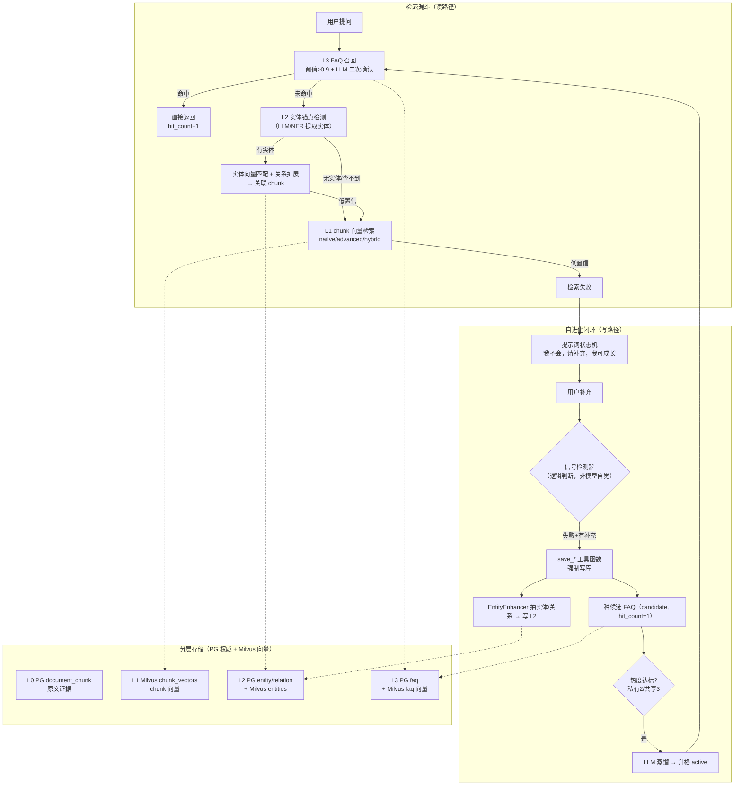

# 自进化 RAG 架构设计

> 面向面试讲述与复习的完整架构文档
> 状态：架构已落地（Phase 1 FAQ 闭环 + Phase 2 实体图谱均已实现）
> 关联设计文档：`docs/plans/2026-08-18-06-self-evolving-rag-design.md`（评审定案版）
> 关联代码：`backend/services/faq_service.py`、`backend/services/retrieval_strategies.py`、`backend/services/enhancers/entity.py`

---

## 0. 一句话定位（电梯陈述）

> 我们给 RAG 系统加了一个**记忆闭环**：知识库查不到时，系统不瞎编，而是引导用户补充，把补充内容**蒸馏成结构化知识**写回库；下次再问，直接命中。随着使用，知识库会自己长大——从"一次性检索工具"变成"越用越懂的业务记忆"。存储上不做图数据库，而是用**纯向量库 Milvus 逼近 GraphRAG 的多跳关联**（实体 + 关系向量化），复用现有三层存储架构，演进成本极低。

这句话里藏了三个可被追问的硬核点：**① 记忆闭环（自进化）② 分层蒸馏 ③ 用向量库实现 GraphRAG**。下面全部展开。

---

## 1. 它解决什么问题（背景与痛点）

传统 RAG 有三个结构性问题，恰好对应我们要做的三件事：

| 痛点 | 传统 RAG 的表现 | 我们的解法 |
|---|---|---|
| **检索失败被吞掉** | 检索返回空/低分，LLM 靠预训练知识硬编（幻觉），用户看不出"它其实不知道" | 把"检索失败"升级为一等公民事件，触发补全闭环 |
| **知识是死的** | 想加知识只能重新上传文档，使用过程不产生任何沉淀 | 使用中自动积累 L2 图谱 + L3 FAQ，复利增长 |
| **多跳关联做不了** | 只有 chunk 向量，"A 和 B 什么关系"这类跨实体问题抓瞎 | 实体 + 关系向量化，沿关系扩展召回 |

一句话：**RAG 的记忆是静态的、一次性的；我们要把它变成动态的、会成长的。**

---

## 2. 方案选型：为什么是这条路

### 2.1 三条路线对比（新知识库策略）

| 方案 | 思路 | 成本 | 结论 |
|---|---|---|---|
| **A. GraphRAG-lite on Milvus** ✅ | 不引入图数据库，把实体描述、关系三元组向量化存进 Milvus，检索时「实体相似度匹配 → 沿关系扩展 → 关联 chunk」 | 中（复用现有三层存储） | **选定** |
| B. LLM Wiki 式概念库 | 抽概念 → 生成百科词条，词条互链，独立知识库类型 | 中 | 偏产品形态，未选 |
| C. 完整微软 GraphRAG | community detection + community summary | 高（实现重、token 贵） | 性价比低，未选 |

**选 A 的核心理由**：它天然坐在我们已有的**适配器架构**上——"图谱化"就是一个新的 Enhancer + 一个新的检索策略，和现有架构完全同构，不需要为它引入第二套存储范式（图数据库）。

**为什么不选 C（微软 GraphRAG）**：它的 community detection 和层级 summary 是面向"大规模、密集关联"语料的；我们的业务场景实体关系相对稀疏，用纯向量扩展的性价比远高于社区检测。这是面试必问点，标准答案就是"成本/收益不匹配"。

### 2.2 关键认知：A 和 B 是同一套思想

这是整个项目最有价值的一个洞察，面试时一定要讲：

> **B（个人知识管理系统：save-knowledge / buglog / recall）是"事件驱动记忆"的元范式；本项目 A 是这个元范式在业务 RAG 上的实例化。**

| 元范式组件 | B（个人知识系统） | 本项目（自进化 RAG） |
|---|---|---|
| 发现信号（hook） | SessionStart / PostToolUse / PostToolUseFailure | **检索失败检测器**（置信度评估） |
| 规范动作（skill） | save-knowledge / buglog / recall | **`save_*` 工具函数**（强制写库） |
| 长期留存（storage） | Obsidian vault / .buglog | **Milvus entities / relations / faq** |
| 何时读 | recall 技能 + 知识地图注入 | 检索漏斗前置 FAQ 召回 + 实体路由 |

所以 B 不是"另一个项目"，它是"记忆架构的通用方法论"；本项目证明了这套方法论能从 coding agent 迁移到业务 RAG agent 上。**这是简历上最亮的一条叙事线。**

---

## 3. 三条核心设计理念

### 理念 1：知识是"分层蒸馏"的资产，不是存一次就完

### 理念 2：写库是"事件驱动"的，不是"模型自觉"的

> 关键判断：**不能让 AI"想起来就写、想不起来就算"**——因为写库是有副作用的、需要可靠性的动作，交给自由文本去完成，模型会写错格式、漏写、乱写。必须用一个**受控的函数调用**去写，且触发条件由**逻辑判断**（检测到"检索失败 + 用户补充"两个条件同时成立），而非模型自主决定。

这一点直接继承了个人知识管理系统里"hook 发现信号、skill 规范动作"的哲学。

### 理念 3：记忆是"闭环"的，不是"一次性"的

```
检索失败 → 引导补充 → 写回 → 下次命中 → 命中累计热度 → 蒸馏固化
```

知识从"补全的一句话"，经过热度验证，最终变成"确定性直返的 FAQ"——这是一个完整的成长周期。

---

## 4. 整体架构全景



**读路径（检索漏斗）**和**写路径（自进化闭环）**是两条独立但咬合的链路，中间由「检索失败信号」和「热度达标信号」连接——这是整个架构的灵魂。

---

## 5. 分层存储模型（L0–L3）

> 这是回答"存原数据 / 切实体 / 存 Obsidian 式词条"三者之争的答案：**不是三选一，而是分层，每层解决不同问题。**

| 层 | 内容 | 载体 | 作用 | 蒸馏来源 |
|---|---|---|---|---|
| **L0 原始层** | 原文文档 / chunk | PG `document_chunk` | 证据溯源、永不丢 | 导入 |
| **L1 向量层** | chunk 的 embedding（+ 摘要/子问题向量） | Milvus `chunk_vectors` / `summary` / `subquestion` | 语义相似检索 | 导入 |
| **L2 图谱层** | 实体（name/type/description）+ 关系三元组 | PG `entity` / `entity_relation` + Milvus `entities` | 多跳关联、概念连接 | 从 L0 **抽取** |
| **L3 结论层** | FAQ（question-answer，LLM 蒸馏产物） | PG `faq` + Milvus `faq` | 高频问题确定性直返 | 从 L0 + 用户补全 **蒸馏** |

**为什么必须分层**（面试重点）：只存一层都会崩——

- 只存 chunk → 多跳推理抓瞎（缺 L2）
- 只存实体 → 丢原文细节、无法溯源（缺 L0）
- 只存 FAQ → 只能答见过的问题、遇新问法就崩（缺 L0+L2 泛化）

分层 = **知识从"原始材料"逐层蒸馏为"高价值、快命中"的形态**，这是"记忆如何越用越有价值"的物理实现。

### 5.1 具体 Schema（已落地）

```sql
-- PG 权威表（database.py）
faq:             faq_id, kb_id, owner_id, submitter_id, question, answer,
                 hit_count, last_hit_time, heat_score, source,
                 status(candidate|active|pending_review), distill_threshold, created_at

faq_pr:          pr_id, source_faq_id, target_kb_id, submitted_by, submitted_at,
                 status(open|merged|rejected), reviewed_by, reviewed_at, review_note

entity:          id, kb_id, name, type, description, source_chunk_ids(JSON), updated_at

entity_relation: id, kb_id, head_entity_id, relation_type, tail_entity_id,
                 evidence, source_chunk_id
```

```python
# Milvus 向量侧（只存用于召回的最小字段 + 向量）
entities:  entity_id, kb_id, name, type, description, description_vector
faq:       faq_id, kb_id, question, question_vector
```

**关键设计：PG 权威 + Milvus 向量**。PG 存完整业务字段（热度、状态、审核），Milvus 只存向量 + 召回所需字段。这与项目里已有的「PG 权威 + Milvus 向量」三层架构保持一致，零新范式。

**字段语义**（面试可能被问到为什么这么拆）：
- `owner_id`（库主）≠ `submitter_id`（实际写入者）——因为共享 KB 的 candidate 可能由非库主提交。
- `distill_threshold` 每条记录自带，写入时按 KB 归属快照（见 §8），升格时直接比对，避免查配置表。
- `status` 三态：`candidate`（待升格）/ `active`（已升格直返）/ `pending_review`（共享 KB 直接提交路径，等库主审核）。

---

## 6. 检索路由漏斗（读路径）

```
用户提问
  │
  ├─ 1. L3 FAQ 召回（阈值 ≥0.9 + LLM 二次确认"该答案是否回答了问题"）
  │     └─ active 命中 → 直返（hit_count+1, last_hit_time 更新）
  │     └─ candidate 命中 → 只累计热度，不直返，达阈值则蒸馏升格
  │
  ├─ 2. L2 实体锚点检测（LLM 提取问题中的实体）
  │     ├─ 有实体 → entities 向量匹配 + 按名直查（双路）→ 关系一跳扩展 → 关联 chunk
  │     │         └─ 实体查不到（新实体）→ 降级 3
  │     └─ 无实体 → 直接 3
  │
  ├─ 3. L1 chunk 向量检索（native / advanced / hybrid 三策略）
  │     └─ 低置信 → 4
  │
  └─ 4. 检索失败 → 提示词状态机 → 补全闭环（见 §7）
```

### 6.1 FAQ 命中的阈值为何要"严"（宁漏勿错）

FAQ 是"直接吐答案"的，一旦误命中（相似但不同的问题）会**答非所问且不自知**。所以：

- FAQ 命中阈值 **0.9**，远高于普通 chunk 检索；
- 命中后还要**再让 LLM 快速确认一次**（一次短判断，"是/否"），拦住误命中。

### 6.2 实体 vs 向量的路由依据（不是模糊二分）

很多人会问"怎么判断走实体还是走向量"。答案不是"全局性 vs 知识点"这种模糊二分，而是**"问题中有无可识别的实体锚点"**：

- 有实体 → 走 L2 图谱；
- 无实体 / 实体查不到 → 降级 L1 向量。

这是可执行、可验证的判断标准。

---

## 7. 自进化闭环（写路径）

这是整个方案区别于普通 RAG 的核心。

### 7.1 提示词状态机

"检索失败"不是一个内部静默事件，它要翻译成用户能感知、能配合的动作：

| Agent 内部状态 | 对用户输出 | 触发的下一步 |
|---|---|---|
| 命中（高置信） | 直接回答 | 正常闭环 |
| 命中（低置信） | "找到相关内容但不确定，你看是不是这个？" | 用户确认/纠正 |
| **失败** | **"这个我不太了解，你如果知道可以告诉我，我会记住并成长"** | 用户补全 → 写回 |

### 7.2 写库必须是函数调用，不是模型自由文本

这是继承个人知识管理系统最核心的一条原则。补全写回不是让 LLM"顺便写一段"，而是：

```
信号检测器（逻辑判断：检索失败 AND 用户提供了补充）
        │
        ▼
save_entity / save_relation / save_faq_candidate   ← 受控工具函数
```

**为什么**：写库有副作用、要求格式可靠，自由文本会写错/漏写/乱写；只有把"写"变成一个明确、受控的函数调用，才能保证记忆的可靠性。这跟个人知识管理系统里"hook 强制触发、而非模型自觉"是同一哲学。

### 7.3 补全后的动作：记录 ≠ 蒸馏

第一次补全**不要立刻蒸馏成 FAQ**，因为可能只是偶发问题。正确区分两个动作：

- **记录**（每次都做，便宜）：写 L2 实体/关系 + 种一条 candidate FAQ（`hit_count=1`，`status=candidate`）。
- **蒸馏**（达标才做，谨慎）：热度/审核/显式信号满足时才把 candidate 升格为 active。

这样 FAQ 库不会被垃圾问题污染。

### 7.4 蒸馏的"源"是什么（关键细节）

FAQ 的答案**不是**用户补全的原话，而是 LLM 整合「用户补全 + 当时检索到的相关 chunk」蒸馏出的**结构化 Q-A + 证据引用**。禁止直接存口语化补全——否则 FAQ 库会变成碎片化对话记录。

---

## 8. 热度计算与蒸馏机制

### 8.1 热度公式（时间衰减 + 频次，简单可解释）

```
heat_score = hit_count × decay(now - last_hit_time)
decay(Δt)  = 0.5 ^ (Δt / 半衰期)        # 半衰期默认 7 天，可配置
```

- `hit_count` 体现"被问了多少次"；
- 时间衰减体现"最近还热不热"——**冷门问题不该永远占着 FAQ 的坑**，这是知识有时效性的体现。

实现上**惰性更新**（每次命中时算），不跑后台定时任务。

### 8.2 蒸馏四触发（OR 关系）

| 触发 | 条件 | 动作 |
|---|---|---|
| **热度阈值（主）** | candidate 的 `hit_count ≥ distill_threshold` | 升格 active，LLM 重新蒸馏答案 |
| **库主审核** | 共享 KB `pending_review` 经库主 merge | 升格 active（人工闸门，不依赖阈值） |
| **显式（兜底）** | 用户说"记住这个" / 管理端手动标记 | 立即升格（低频但关键） |
| **种子（每次补全）** | 检索失败 + 用户补全 | 写 L2 + 种 candidate（**不立即蒸馏**） |

### 8.3 阈值跟"污染面"走（面试亮点）

蒸馏阈值不是全局一个数，而是**跟 candidate 所在 KB 的可见范围（= 污染面）走**：

| candidate 所在 KB 归属 | `distill_threshold` | 理由 |
|---|---|---|
| 我的私有 KB（含克隆版） | **2**（快速沉淀） | 只有我看得见，错了只坑自己 |
| 我分享出去的 KB | **3**（防污染） | 全员可见，错了全员遭殃 |
| 别人分享给我的 KB（直接提交） | 不走阈值，走库主审核 | 人工闸门比阈值更可控 |

这个设计把"多少热度才够格固化"和"错了会影响多少人"绑定在一起，是容易被忽略但很见功力的权衡。

---

## 9. 多租户与协作：KB 可见性 + GitHub 式 fork/PR

### 9.1 记忆范围：KB 可见性驱动（无 global scope）

**核心模型**：记忆条目只带 `kb_id`，**不带 `scope` 字段**。可见性完全跟 KB 的分享关系走——KB 私有则只有主人能读，KB 被分享则被分享者能读。"全局"只是**检索入口决定的读取视野**，不是写入位置。

| 检索入口 | 读取范围 |
|---|---|
| KB 级检索 | 该 KB 的所有 active FAQ + entities + relations |
| 全局检索 | 我可见的所有 KB（我的私有 + 我分享出去的 + 别人分享给我的） |

### 9.2 写入路径：fork/PR 双路径（借鉴 GitHub）

补全写入的目标 KB 必须是"我能写的私有 KB"（默认 `DEFAULT_PERSONAL_KB_ID`）。共享 KB 的写入只走两条路径：

| 路径 | 写到哪 | 升格机制 |
|---|---|---|
| **(a) 克隆后写**（fork） | 我克隆出的私有 KB（快照克隆，不追上游） | 私有阈值 2，自动升格 |
| **(b) 直接提交**（PR） | 上游共享 KB 的 `pending_review` 队列 | 库主审核（人工闸门） |

**核心规则**：全局入口**永不直接写共享 KB**——因为全局入口下"目标 KB"歧义太大（同时搜了多个 KB），直接写会误污染全员。这避免了"全局补全误污染全员"的风险。

**去重**：同 KB 内 question embedding 相似度 ≥0.95 判为同一记忆 → `hit_count` 累加而非新插入（共享 KB 多人重复补全自然聚合为热度）。

---

## 10. 具体实现形式（代码落点）

> 这是解决"个人知识库文档太笼统"的关键——每一层都有明确的文件、类、函数对应。

### 10.1 检索策略注册表（可插拔架构）

`backend/services/retrieval_strategies.py` 用装饰器注册策略，新增检索模式**不改 milvus_client**：

```python
@register_strategy
class GraphStrategy(RetrievalStrategy):
    name = "graph"
    # 1. LLM 提取实体锚点（_extract_anchor_names）
    # 2. 按名直查 + 向量匹配（双路锚点发现）
    # 3. db.get_entity_neighbors() 关系一跳扩展
    # 4. 收集 source_chunk_ids → 取 chunk 原文返回
    # 5. 无锚点/查不到实体 → 降级 native
```

`SearchContext` 已预留 `entities_collection` 字段，graph 策略按需取用。

### 10.2 FAQ 记忆服务

`backend/services/faq_service.py` 的 `FAQService`：

| 方法 | 职责 |
|---|---|
| `try_faq_hit(query, user_id, kb_id)` | FAQ 前置召回：active 直返 / candidate 累计热度 |
| `_confirm_answer(query, answer)` | LLM 二次确认（宁漏勿错） |
| `supplement(question, answer, user_id, kb_id)` | 补全写入（fork/PR 路径判定 + 去重 + 种 candidate） |
| `distill_and_promote(faq_id)` | candidate → active，LLM 蒸馏结构化答案 |
| `merge_pr / reject_pr` | PR 审核（库主） |
| `clone_kb` | 快照克隆（PG + Milvus 向量 + BM25 索引搬运） |
| `resolve_write_path` | 判定写入路径（direct/pr）与阈值 |

### 10.3 实体抽取增强器

`backend/services/enhancers/entity.py` 的 `EntityEnhancer`：

- 挂在文档 03 的 **Enhancer 适配器**架构上（`EnhancerPipeline`），KB 级可开关；
- 从 chunk 抽 `entities`（name/type/description）+ `relations`（head/relation/tail/evidence）；
- 用 pydantic 约束输出 JSON 结构，解析失败降级为空（不崩）。

### 10.4 数据层

`backend/services/database.py` 已建 `faq` / `faq_pr` / `entity` / `entity_relation` 四张表 + 索引，方法齐全（`upsert_entity`、`add_entity_relation`、`get_entity_neighbors`、`find_entities_by_names`、`add_faq`、`increment_faq_hit`、`promote_faq`）。

### 10.5 审计联动

所有记忆的写入、升格、PR 提交/合并/拒绝、删除都走 `services/audit.py`（文档 07 审计中心），支撑共享模式下的可信性与对账。

---

## 11. 与个人知识管理系统（B）的同构关系

> 面试时用一个"统一抽象"把两个项目串起来，是最能体现系统设计能力的地方。

| 元范式 | 个人知识管理系统（B） | 自进化 RAG（本项目） |
|---|---|---|
| 记忆主体 | coding agent（Codex/Claude Code） | 业务 RAG agent |
| 发现信号 | hook（SessionStart/PostToolUse/Failure） | 检索失败检测器 |
| 规范动作 | skill（save-knowledge/buglog/recall） | `save_*` 工具函数 |
| 长期留存 | Obsidian vault / .buglog | Milvus entities/relations/faq |
| 召回 | recall 技能 + 知识地图注入 | FAQ 前置召回 + 实体路由 |
| 时效判断 | ref_count + 人工时效判断 | 热度衰减（半衰期） |

**结论**：B 是"事件驱动记忆"的**元范式**，本项目是它在**业务 RAG** 上的实例化。二者不是并列的两个项目，而是**同一个思想在两种 agent 上的两次落地**——这个认知跳跃是简历叙事的核心。

更深一层：Codex/Claude Code 本质是 React Agent（有工具、会循环、会函数调用）；我们的 RAG 同样接 Agent 变成 Agentic RAG。**既然都是 agent，就都需要记忆**——所以个人知识管理系统的模式天然可迁移。这是"为什么能迁移"的底层逻辑。

---

## 12. 考虑过的关键问题与权衡（面试追问点）

| 问题 | 我们的权衡与答案 |
|---|---|
| 为什么不做图数据库（Neo4j）？ | 复用现有 Milvus 三层存储，零新范式；实体关系稀疏场景下纯向量扩展够用，避免维护第二套存储 |
| 为什么不做微软 GraphRAG？ | community detection + summary token 成本高、实现重，性价比低 |
| FAQ 误命中怎么办？ | 阈值 0.9 + LLM 二次确认，宁漏勿错 |
| 补全被垃圾信息污染？ | 记录≠蒸馏，热度/审核/显式三闸门；前端提供手动删除/降级 |
| 冷门但重要的问题永不蒸馏？ | 显式触发兜底（用户说"记住这个"） |
| 共享 KB 多人补全冲突？ | 相似度 ≥0.95 判重聚合，hit_count 累加 |
| 全局入口误污染共享 KB？ | 全局补全永远写私有 KB，共享 KB 只走 fork/PR |
| 库主不审核 PR 堆积？ | PR 队列排序 + 提醒 + admin 批量处理 |
| 克隆版与上游数据不一致？ | 快照克隆（不追上游），符合"个人知识快照"语义 |
| 蒸馏的答案哪来的？ | 补全原文 + 相关 chunk 上下文，LLM 结构化整合，非口语原文 |

---

## 13. 简历叙事建议

**三条，分开写再合并**：

**① 独立一条——个人知识管理系统（B，元范式）**

> 设计并实现面向 AI 编码助手的个人知识管理系统，采用「规则层 → 技能层（save-knowledge/recall/buglog）→ Hook 触发层（SessionStart/UserPromptSubmit/PostToolUse 事件钩子强制触发）→ 存储层（Obsidian + .buglog）」四层架构。核心洞察是"hook 负责发现信号、skill 负责规范动作、存储负责长期留存"，把知识写入从"模型自觉"变成"事件驱动"，解决 agent 记忆可靠性问题。

**② 项目经历——自进化 RAG（A，实例化）**

> 主导 RAG-for-QW 新知识库策略：对比 GraphRAG-lite（纯向量库）、LLM Wiki 概念库、微软 GraphRAG 三方案，选定 GraphRAG-lite。不引入图数据库，将实体描述与关系三元组向量化存入 Milvus，检索经「实体相似度匹配 → 关系扩展 → 关联 chunk 召回」逼近多跳关联。设计分层存储 L0 原文/L1 chunk/L2 实体关系/L3 FAQ，检索漏斗 FAQ 直返 → 实体路由 → 向量降级 → 失败补全，形成"检索失败 → 用户补全 → 热度蒸馏 → 下次命中"的自进化闭环。采用 PG 权威 + Milvus 向量三层架构，GitHub 式 fork/PR 支持多租户知识协作。

**③ 合并升华（一句话）**

> 将"个人知识管理系统"与"自进化 RAG"统一为同一架构思想：前者是人/agent 侧的显式知识流，后者是机器侧的语义图谱 + 记忆闭环，二者在"事件驱动记忆"维度同构，前者是可迁移的元范式。

---

## 14. 面试高频追问 + 回答要点

1. **"检索失败怎么检测的？"** → 置信度阈值 + 状态机分支，失败是逻辑产生的一等公民事件，不是 LLM 自由判断。
2. **"为什么写库用函数而不是让 LLM 写？"** → 写库有副作用、要求可靠，自由文本会乱写；函数调用受控、格式确定，继承 hook 强制触发哲学。
3. **"实体怎么抽、关系词表哪来的？"** → EntityEnhancer（pydantic 约束 JSON），relation_type 开放词表 + evidence 证据，宁缺毋滥（实体 1~6、关系 0~5）。
4. **"热度和蒸馏阈值为什么私有 2 共享 3？"** → 阈值跟污染面（KB 可见范围）走，错了影响的人越多阈值越严。
5. **"FAQ 会不会越攒越多、库越来越脏？"** → 时间衰减（半衰期 7 天）+ 手动删除/降级 + 记录≠蒸馏。
6. **"和普通 RAG 相比，延迟增加了吗？"** → FAQ 命中是短路直返（更快）；未命中才多一次实体锚点 LLM 调用，可用小模型或合并 prompt 控成本。
7. **"这套东西实测过吗？"** → FAQ 闭环 45/50 通过（5 个脚本侧重复 delete 404），created 20/merged 14/promoted 6；审计对账零缺口。（详见 `docs/plans/stage-4-report.md`）

---

## 附：代码文件索引

| 文件 | 内容 |
|---|---|
| `backend/services/faq_service.py` | FAQ 闭环全逻辑（召回/补全/蒸馏/PR/克隆） |
| `backend/services/retrieval_strategies.py` | 策略注册表 + GraphStrategy 实体图谱检索 |
| `backend/services/enhancers/entity.py` | EntityEnhancer 实体/关系抽取 |
| `backend/services/database.py` | `faq`/`faq_pr`/`entity`/`entity_relation` 表 + 方法 |
| `backend/services/audit.py` | 记忆写入/升格/PR 审计 |
| `docs/plans/2026-08-18-06-self-evolving-rag-design.md` | 评审定案版设计文档（含验证方式/风险） |
